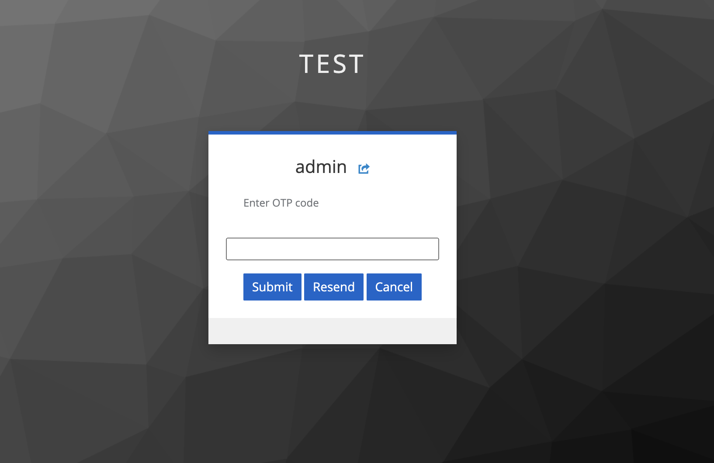

# 🔒 Keycloak 2FA Email Authenticator

Keycloak Authentication Provider implementation to get a two factor authentication with an OTP/code/token send via Email (through SMTP)

When logging in with this provider, you can send a verification code (otp) to the user's e-mail address.
Tested with Keycloak version 19.x, if you are using different Keycloak version, don't forget to change the version in pom.xml file.

The [Server Development part of the Keycloak reference documentation](https://www.keycloak.org/docs/latest/server_development/index.html) contains additional resources and examples for developing custom Keycloak extensions.

# 🚀 Deployment

## Provider

`mvn package` will be create a jar file.
copy _keycloak-2fa-email-authenticator.jar_ to _keycloak/providers/_ directory.

if you are Dockerized keycloak then copy to _/opt/jboss/keycloak/standalone/deployments/_ directory.

## Theme Resources

**html/code-email.ftl** is a html email template. Copy to _themes/base/email/html/_

**text/code-email.ftl**  Copy to _themes/base/email/text/_

**messages/*.properties** Append to _themes/base/email/messages/messages_en.properties_

# Configuration

## Email Configuration
SMTP setting configure for e-mail send.
_Realm Settings/Email_

## Authentication Flow
Create new browser login authentication flow and add Email OTP flow before Username Password Form.

