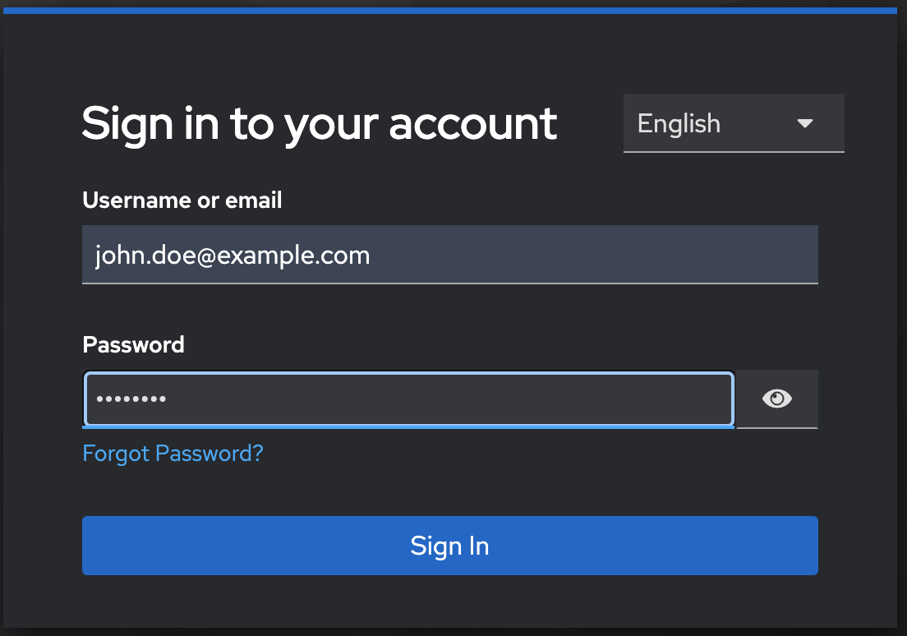
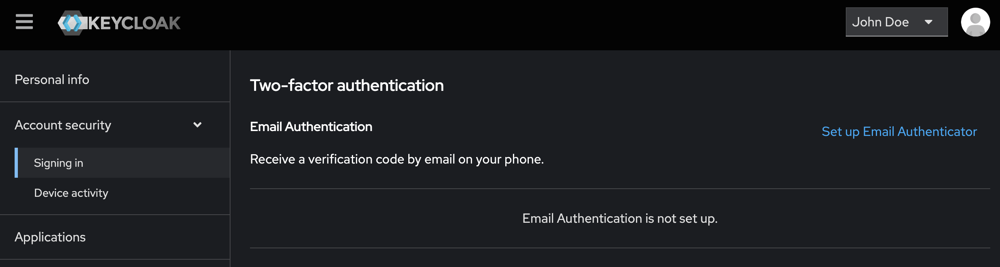
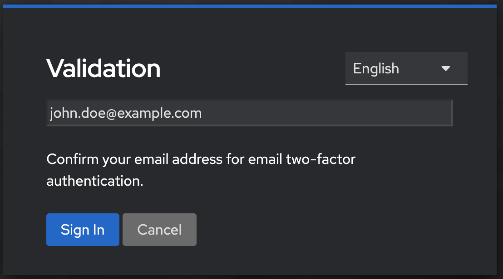
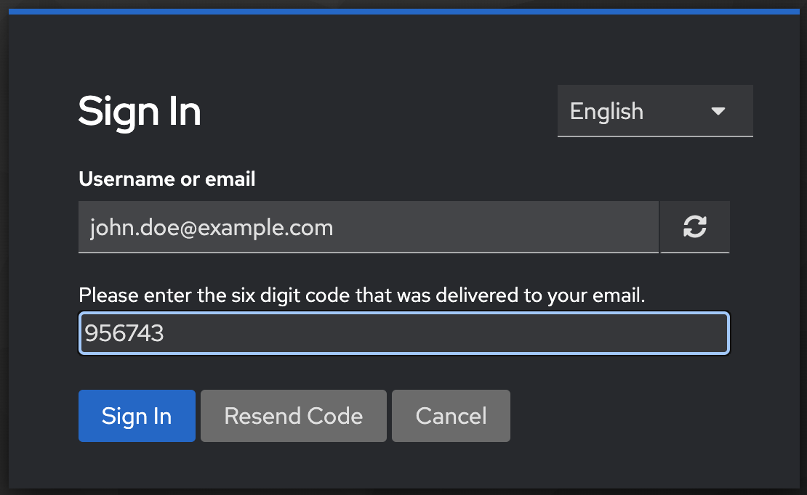

# 🔒 Keycloak 2FA Email Authenticator

Keycloak Authentication Provider implementation to get a two factor authentication with an OTP (One-time-password) send via Email (through SMTP).

When logging in with this provider, you can send a verification code (OTP) to the user's e-mail address.
Tested with Keycloak version 26.x. If you are using a different Keycloak version, don't forget to change the version in pom.xml file.

The [Server Development part of the Keycloak reference documentation](https://www.keycloak.org/docs/latest/server_development/index.html) contains additional resources and examples for developing custom Keycloak extensions.

# Development

If you are using Eclipse, you need to install the Lombok plugin, otherwise Eclipse cannot resolve `log` which is declared at runtim through @JBossLog annotation.
Find further information at https://projectlombok.org/setup/eclipse

# 🚀 Deployment

## 🖥 Local Build

> This project requires **Java 21** and Maven.

1. **Install Java 21**
   Check your Java version:
   ```bash
   java -version
   ```
   Ensure it shows Java 21. If not, download and install it from [Adoptium](https://adoptium.net/) or another trusted source.

2. **Install Maven**
   Verify Maven installation:
   ```bash
   mvn -version
   ```
   If Maven is not installed, download it from [Apache Maven](https://maven.apache.org/download.cgi) and follow the installation instructions.

3. **Clone the Repository**
   Clone this project to your local machine:
   ```bash
   git clone <repository-url>
   cd <repository-directory>
   ```

4. **Build the Project**
   Run the following command to build the project and generate the JAR file:
   ```bash
   mvn clean package
   ```
   This will create the JAR file `target/keycloak-2fa-email-authenticator-<version>.jar`.

5. **Deploy the JAR**
   - For a standard Keycloak installation, copy the generated JAR file to the Keycloak providers directory:
     ```bash
     cp target/keycloak-2fa-email-authenticator-<version>.jar <keycloak-home>/providers/
     ```
   - For a Dockerized Keycloak setup, copy the JAR to the deployments directory:
     ```bash
     cp target/keycloak-2fa-email-authenticator-<version>.jar /opt/jboss/keycloak/standalone/deployments/
     ```

6. **Build Keycloak**
   Ensure Keycloak recognizes the new provider by running:
   ```bash
   bin/kc.sh build
   ```

## Providers

`mvn package` will create a jar file.
copy `keycloak-2fa-email-authenticator.jar` to `keycloak/providers/` directory.

If you are Dockerized keycloak then copy to `/opt/jboss/keycloak/standalone/deployments/` directory.

## Build

Don't forget to start kc.sh with build parameter to make KeyCloak recognize the new povider:

> bin/kc.sh build

# Configuration

## Email Configuration

Don't forget to configure your realm's SMTP settings, otherwise no email will be send:

1. Login as admin on your Keycloak installation.
2. Switch to your realm
3. Click `Realm settings` from the menu on the left.
4. Click on the `Email`-tab and enter your smtp data.

## Authentication Flow

1. Navigate to **Authentication > Required Actions**. For the **Email OTP** action, enable it by clicking **On** in the **Enabled** column.
2. Duplicate the browser login authentication flow: Go to **Authentication > Flows**. Next to the **browser** flow, click the three dots (...) and select **Duplicate**.
3. Bind the new flow: Click on the name of the duplicated flow, then select **Actions > Bind** Flow (and choose the appropriate binding, such as for browser authentication).
4. In your new flow, after the **OTP Form** step, add **Email OTP** as an **Alternative** execution.
5. For the **Email OTP** step, click the settings icon (small gear wheel) and set the **Alias** to **email-2fa**.
6. Optionally, to force OTP usage, enable **Force 2FA** by setting it to **On**.

## Workflow

1. First perform a simple login.



2. Setup 2FA from the account-console application section **Signing-In > Two-factor authentication**



3. Validate the email address that is already registered and disconnect from account-console application



4. Perform a simple login.


5. Then, complete the 2FA verification via email.

